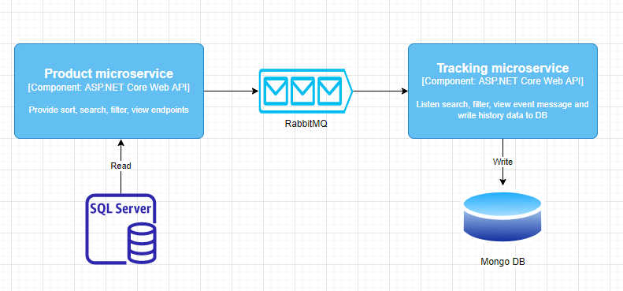
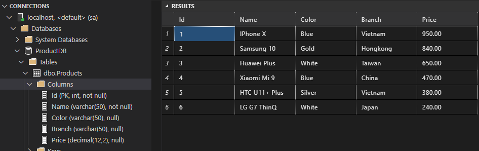
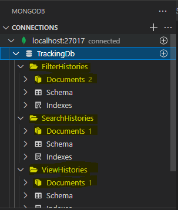

Event-Driven Microservice Architecture
======================================
Microservices implemented using:
* ASP.NET Core Web API
* RabbitMQ
* SQL Server
* MongoDB
* Docker
* Flyway

Architecture overview
---------------------
The sstCommerce system is using a microservice oriented architecture with database per service (each service has it’s own database server) and implementing different patterns within each microservice (simple CRUD vs. DDD patterns) using HTTP as the communication protocol between the client apps and the microservices and supports asynchronous communication across multiple services based on Event-Driven Microservices pattern.

Components overview
-------------------

Product microservice:
* ASP.NET Core Web API application
* REST API principles, CRUD operations
* SQL Server database connection on docker

Tracking microservice:
* ASP.NET Core Web API application
* CRUD operations
* Mongo DB NoSQL connection as a Database on docker

RabbitMQ messaging library:
* Define data structures for EventBus

Prerequirements
----------------
* Visual Studio Code
* .NET 6.0.2 SDK
* Docker Desktop

How to run the solution
-----------------------
1. Clone the repository
2. At the root directory, run the command:
``` 
docker-compose -f docker-compose.yml -f docker-compose.override.yml up –d
``` 
Launch microservices:
* RabbitMQ: http://localhost:15672/
* Product API: http://localhost:8000/swagger/index.html
* Tracking API: http://localhost:8001/swagger/index.html

Test end points:
---------------
Check ProductDB data



Test End point /api/v1/Product/SearchProducts/{username}/{keyword}
```
curl -X GET "http://localhost:8000/api/v1/Product/SearchProducts/A/a" -H  "accept: text/plain"
```
Test End point /api/v1/Product/FilterProductByColor/{username}/{value}
```
curl -X GET "http://localhost:8000/api/v1/Product/FilterProductByColor/A/White" -H  "accept: text/plain"
```
Test End point /api/v1/Product/FilterProductByBranch/{username}/{value}
```
curl -X GET "http://localhost:8000/api/v1/Product/FilterProductByBranch/A/China" -H  "accept: text/plain"
```
Test End point /api​/v1​/Product​/ViewProduct​/{username}​/{id}
```
curl -X GET "http://localhost:8000/api/v1/Product/ViewProduct/A/1" -H  "accept: text/plain"
```
Check data in Mongo DB

